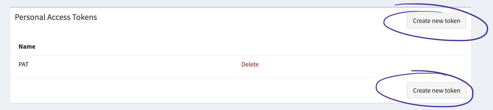

# Firefly-III Bank Sync

This small piece of code is intended to sync monobank (particular ukrainian bank)
by getting transactions via monobank API and putting them to firefly.

As the AI categorizer is present there seems to be it fork to categorize transaction
from this app

## Installation

### 1. Get a Firefly Personal Access Token

1. Log in to your Firefly III instance.
2. Navigate to "Options" > "Profile" > "OAuth."
3. Look for the section labeled "Personal Access Tokens."
4. To generate a new Personal Access Token, click on the "Create New Token" option.
5. Assign a meaningful name to the token for easy identification, and then click
"Create."
6. Keep in mind that the Personal Access Token will be quite lengthy.

### 2. Get monobank token

1. Navigate to the official [monobank api website](https://apimonobank.ua)
2. Authorize with qr code scanner within an app or by pressing the qr (from phone)
3. Get the API token generated for you and store it in a safe place

### 3. Deploy app

1. Copy compose [file](docker-compose.yml) to your server
2. Populate values according to the [variables referece](#variables-reference)
3. Run the app with `docker compose up -d` or `docker-compose up -d`

## Variables reference

- FBS_HOST - URL where your instance is accessible. Populate with URL in format
  `http[s]://host:[port]`
- MONOBANK_API_TOKEN - Your monobank API token from step #2
- LOG_LEVEL - Log level for app. Available options are:
  trace, debug, info, err, fatal, panic
- LISTEN_ADDRESS - Address to listen on. By default :3000 is used. Advised not
  to be changed
- FFI_TOKEN - Your firefly-iii PAT (Personal Access Token) token from step 1
- FFI_URL - Your firefly-iii instance url. Populate with your firefly-iii
  instance URL in format `http[s]://host:[port]`
